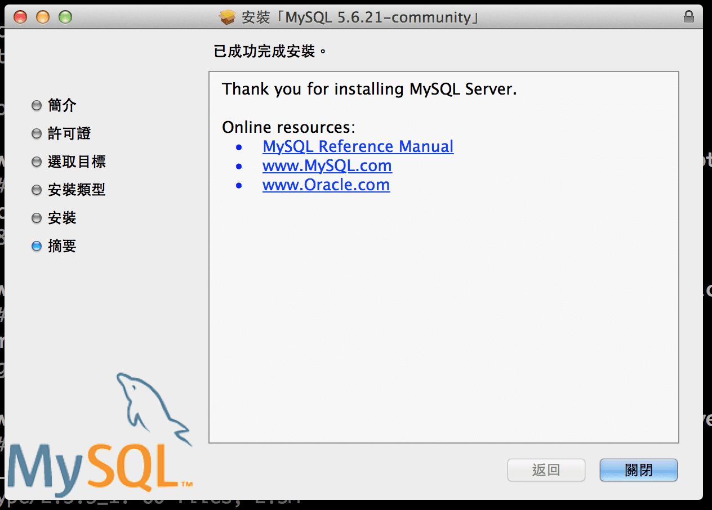
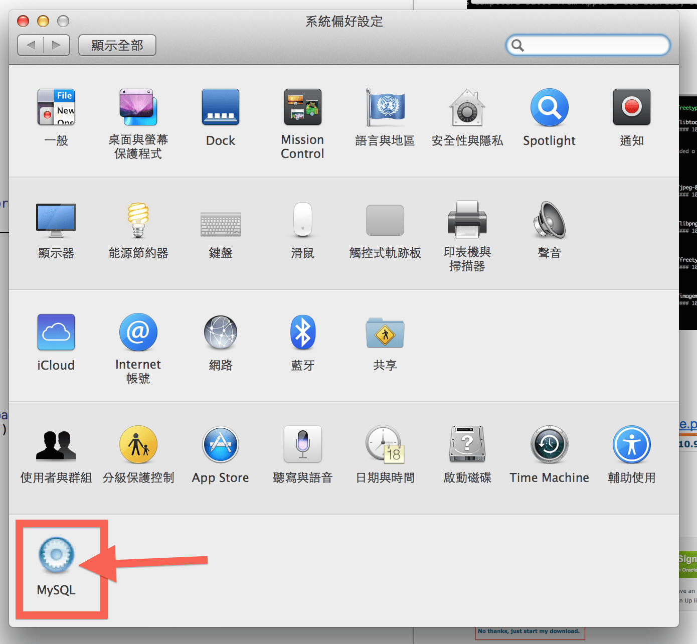
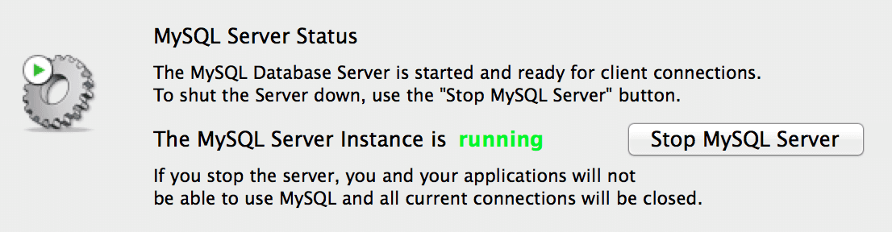
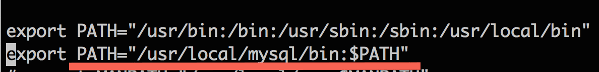

# Mac MySQL 筆記

## 安裝
* 官網下載 .dmg 檔 [http://dev.mysql.com/downloads/file.php?id=454017](http://dev.mysql.com/downloads/file.php?id=454017)

* 一直下一步、下一步安裝

* 若是 **OSX 10.10 以上**，請把選項 `startup Item` 取消！

* 安裝完成後，打開系統偏好設定，點選 MySQL

* 加 MySQL PATH 至 ZSH
	* 編輯 .zshrc，`vim ~/.zshrc`
	* 加入 `export PATH="/usr/local/mysql/bin:$PATH"`
	
	* 確認是否成功 `echo $PATH`
	
	* 重新開啟 iTerm

* 設定 root 密碼
	* 進入 MySQL，`mysql -u root`
	* 選擇資料庫 `use mysql;`
	* 更新資料 `update user set password=PASSWORD("你的密碼") where User='root';`
	* 刷新 MySQL，`flush privileges;`
	* 離開 MySQL，`quit`

	> 注意！設置密碼時，要記得加上**引號**，假設密碼為 1234，應該為:
	>
	> `update user set password=PASSWORD("1234") where User='root';`
	>
	> 以上參考: [http://stackoverflow.com/questions/6474775/setting-the-mysql-root-user-password-on-osx](http://stackoverflow.com/questions/6474775/setting-the-mysql-root-user-password-on-osx)

