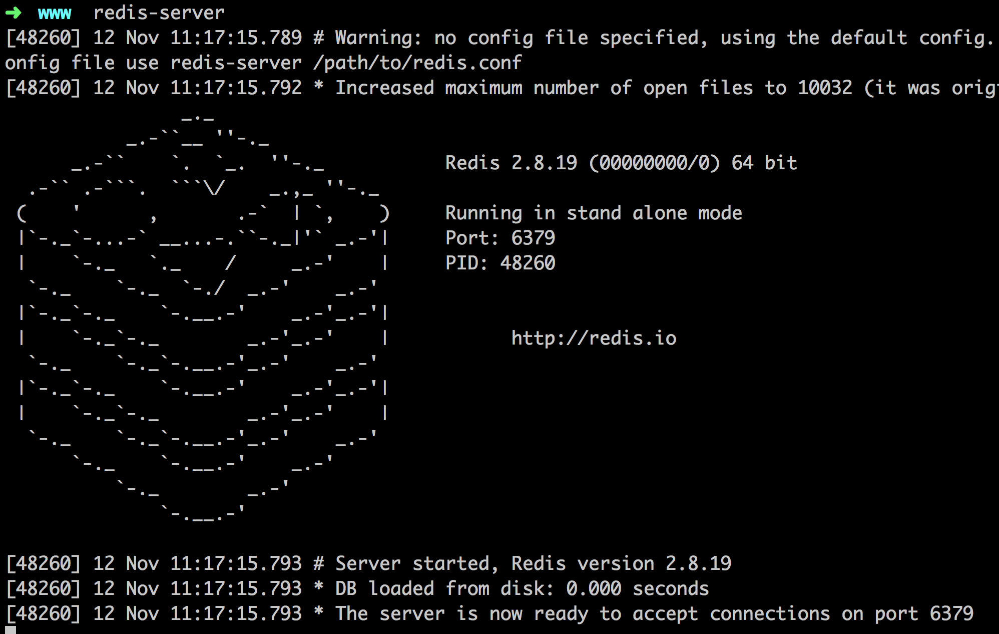

# Mac Redis 筆記

## Install
1. Homebrew 安裝(簡單快速)
	* 指令 `brew install redis`

2. 一步步安裝
	* 下載 Redis [http://download.redis.io/releases/](http://download.redis.io/releases/)，指令下載 `wget http://download.redis.io/releases/redis-3.0.5.tar.gz`
	* 解壓縮，進入目錄，指令 `tar xzf redis-3.0.5.tar.gz`，進入目錄 `cd redis-3.0.5`
	* 安裝測試 `sudo make test`
	* 安裝 `make`

## Redis 指令
* 啟動 server 指令 `redis-server`
	
* Client 指令 `redis-cli`

## 管理工具 phpRedisAdmin
* 使用 phpRedisAdmin 前，請先確認是否已經安裝 Redis
* 終端機移至 server DocumentRoot(根目錄) 內，並下指令：

	```
git clone https://github.com/ErikDubbelboer/phpRedisAdmin.git
```

	```
cd phpRedisAdmin
```

	```
git clone https://github.com/nrk/predis.git vendor
```

* 設定連線位置、port，檔案位置 `phpRedisAdmin/includes/config.sample.inc.php` 修改：

	```
$config = array(
  'servers' => array(
    array(
      'name' => 'local server',
      'host' => '127.0.0.1',
      'port' => 6379,
      'filter' => '*',
      'db'   => 0,
      .....
```

* 用瀏覽器開啟 [http://127.0.0.1/phpRedisAdmin](http://127.0.0.1/phpRedisAdmin)

---

相關參考：

* Redis 官網 - [http://redis.io/commands](http://redis.io/commands)
* phpRedisAdmin GitHub - [https://github.com/ErikDubbelboer/phpRedisAdmin](https://github.com/ErikDubbelboer/phpRedisAdmin)
* Wiki - [http://zh.wikipedia.org/wiki/Redis](http://zh.wikipedia.org/wiki/Redis)
* Redis 簡體翻譯指令查詢 - [http://redis.readthedocs.org/en/latest/](http://redis.readthedocs.org/en/latest/)
* 說明部落格 - [http://aside-cave.blogspot.tw/2013/01/redis-as-a-data-structure-server.html](http://aside-cave.blogspot.tw/2013/01/redis-as-a-data-structure-server.html)