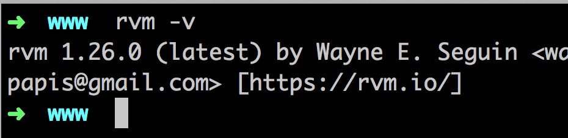
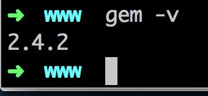
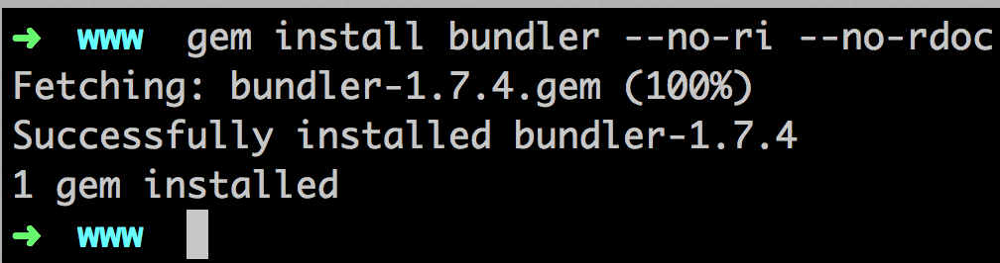
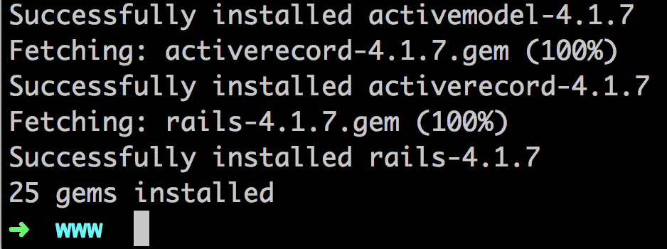

# Mac Roby on Rails 筆記

## 系統

* 更新 OSX

	

* 下載 & 更新 Xcode

	

## Homebrew

* 安裝 homebrew 可以參考[這篇](homebrew.html)

## ImageMagick

* 安裝 XQuartz
	* 安裝 ImageMagick 需先有 X11 的 Support，OSX 10.8 拿掉了，所以需要下載安裝，[載點](http://xquartz.macosforge.org/landing)
	* 它是 **.dmg** 檔案，基本上就是下一步、下一步的安裝就可以，安裝完後重開

		

* 安裝 ImageMagick，`brew install imagemagick`

	

## MySQL

* 安裝 MySQL 可以參考 [此篇](mysql.html)

## RVM

* RVM [官網](https://rvm.io/)

* `curl -L https://get.rvm.io | bash -s stable`

	

* 檢查是否安裝成功，重新開啟 iTerm，`rvm -v`

	

* Oh My Zsh
	* 若尚未安裝 [Oh My Zsh](https://github.com/robbyrussell/oh-my-zsh) 就執行 `echo '[[ -s "$HOME/.rvm/scripts/rvm" ]] && . "$HOME/.rvm/scripts/rvm" # Load RVM function' >> ~/.bash_profile`

	* 若安裝 RVM 後才安裝 [oh my zsh](https://github.com/robbyrussell/oh-my-zsh) 就執行 `echo '[[ -s "$HOME/.rvm/scripts/rvm" ]] && . "$HOME/.rvm/scripts/rvm" # Load RVM function' >> ~/.zshrc`

		> 一般新的 mac 都不會安裝 oh my zsh。

* 若指定預設 Ruby 版本時出現權限問題可以這樣做，輸入 `suod chown xxx:root /usr/local/bin #xxx 是你的user`

* RVM 使用[範例](http://beginrescueend.com/rvm/basics/)

	```
	  rvm list                      # 列出電腦中已經安裝的 ruby 版本
	  rvm list known                # 列出所有可安裝的 ruby 版本
	  rvm ruby-1.8.7-p334           # 切換ruby 版本到 ruby-1.8.7-p334
	  rvm ruby-1.8.7-p334 --default # 設定 ruby-1.8.7-p334 為預設的版本
	  rvm install ruby-1.8.7-p334   # 安裝 ruby-1.8.7-p334
```

## Ruby

* Ruby [官網](https://www.ruby-lang.org/zh_tw/)

* 首先使用 RVM 列出可以安裝的 Ruby 版本 `rvm list known`

	

* 安裝 2.1.3，`rvm install 2.1.3`

	

* 測試是否安裝成功 `ruby -v`

	

* 若有出現 readline.c 的錯誤時，可以試著以下指令:

	```
	rvm package install readline
	# 然後在安裝指令的後面加上 -C --with-readline-dir=$rvm_path/usr
	rvm install 1.9.3 -C --with-readline-dir=$rvm_path/usr
```

## RubyGems

* RubyGems [官網](https://rubygems.org/)

* `rvm rubygems current`

	

* 檢查是否安裝成功 `gem -v`
	
	

* 設定 `--no-ri --no-rdoc` 的參數，一般安裝 gem 也會同時安裝該 gem 的文件，但通常這些文件都是在網路上看的，因此不需要浪費空間和時間安裝在自己的電腦。
	
	```
	vim ~/.gemrc   # 打開 ~/.gemrc
	# 加上以下後, 存檔重新登入命令列即可
	gem: --no-ri --no-rdoc
```

## Bundler

* `gem install bundler --no-ri --no-rdoc`

	

	> 若已經有設定 ```--no-ri --no-rdoc``` 為預設參數，則就不需要再加上 ```--no-ri --no-rdoc```。

## 安裝 Rails

* 如果是要安裝目前最穩定版本 `gem install rails --no-ri --no-rdoc`

	

* 檢查是否安裝成功 `rails -v`

	

* 如果是要安裝特別版本 `gem install rails -v=3.2.8 --no-ri --no-rdoc`

---

## 以上參考

* RVM - [https://rvm.io/rvm/install/](https://rvm.io/rvm/install/)
* Rails 101 - [https://readmoo.com/book/210010467000101](https://readmoo.com/book/210010467000101)
* 五樓專業團隊 - [http://pm.5fpro.com/projects/public-wiki/wiki/MaxOS_-_Ruby_on_Rails](http://pm.5fpro.com/projects/public-wiki/wiki/MaxOS_-_Ruby_on_Rails)
