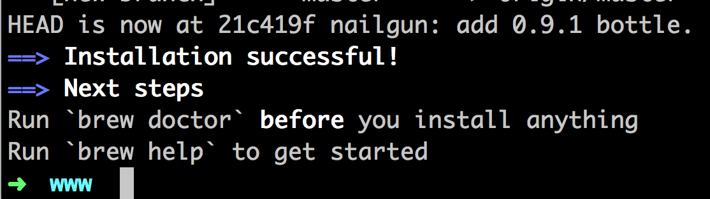
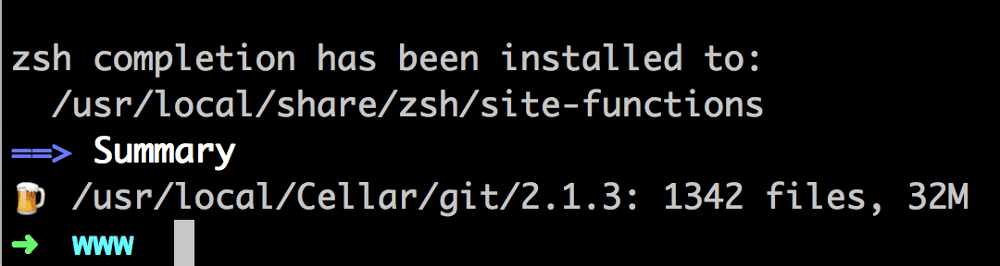
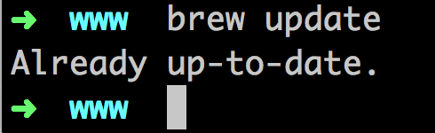
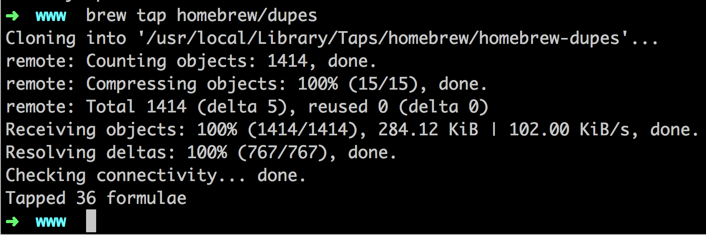
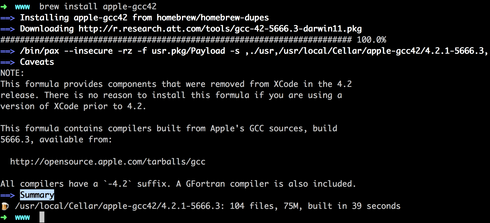

# Mac Homebrew 筆記

## 安裝

* `ruby -e "$(curl -fsSL https://raw.githubusercontent.com/Homebrew/install/master/install)"`

	

* 安裝 git，`brew install git`

	

* 更新 Homebrew，`brew update`

	

* `brew tap homebrew/dupes`

	

* 安裝 apple-gcc，`brew install apple-gcc42`

	

